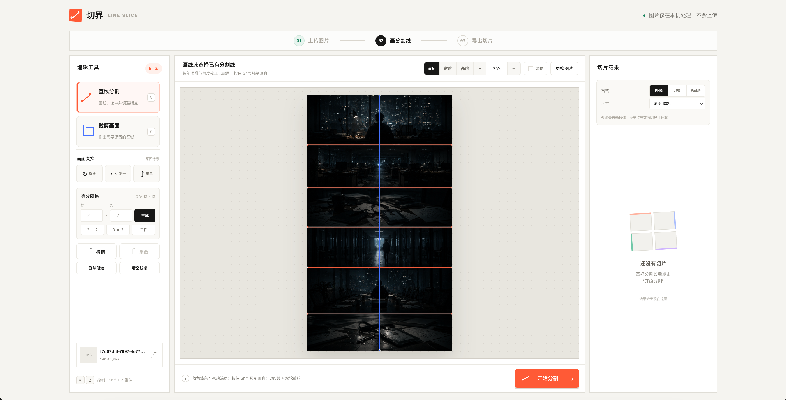

# Qiejie · 切界



> 画线，切图。一个不上传原图的纯浏览器图片分割工具。

[在线使用](https://qiejie.chasenh.chatgpt.site/) · [GitHub](https://github.com/hcsdtk/qiejie) · [反馈问题](https://github.com/hcsdtk/qiejie/issues)

## 这是什么

Qiejie（切界）把图片分割变成一个简单的浏览器工作流：打开图片，在画布上画出边界，预览切片，然后导出 PNG、JPG、WebP 或 ZIP。所有图像处理都在当前设备完成，原图不会上传到服务器。

它适合处理长截图、漫画、海报、设计稿、社交媒体拼图和临时素材拆分。既可以自由画线，也可以用规则网格快速生成切片。

## 为什么做

常见的图片切割工具要上传原图、只能使用固定网格，或者需要安装桌面软件。Qiejie 希望提供一个更快、更透明的选择：

- 用户决定边界，而不是被固定模板限制
- 图片留在本机，适合不希望上传素材的场景
- 打开即用，不安装软件，也不需要注册账号
- 导出结果清晰可控，方便继续设计、发布或批量处理

## 功能一览

- 拖拽、文件选择、剪贴板粘贴图片
- 直线分割，默认启用端点吸附和角度校正
- 按住 `Shift` 锁定水平、垂直或 45° 直线
- 可选的细密参考网格（仅用于编辑，不会导出）
- 选中、拖动、删除分割线，支持撤销与重做
- 裁剪、顺时针旋转、水平翻转、垂直翻转
- 2×2、3×3、三栏和最多 12×12 自定义等分网格
- 适应、宽度铺满、高度铺满和 5%–400% 手动缩放
- 高清编辑预览，按原图像素生成切片
- 大图分割识别使用 Web Worker，显示进度并支持取消
- PNG、JPG、WebP 导出，支持尺寸倍率和质量设置
- 单张下载、保存到文件夹、本地 ZIP 打包下载

## 使用方法

1. 打开[在线版本](https://qiejie.chasenh.chatgpt.site/)，拖入、选择或粘贴一张图片。
2. 选择“直线分割”或“裁剪画面”。直线模式下，从画布的一侧拖到另一侧；按住 `Shift` 可锁定直线角度。
3. 用“适应”“宽度”“高度”或缩放按钮调整视图；需要定位时打开画布网格。
4. 需要规则切图时，在“等分网格”中输入行列数并点击“生成”。
5. 检查切片结果，选择格式、尺寸和质量，然后下载单张或打包 ZIP。

## 本地开发

环境要求：Node.js `>=22.13.0`、npm。

```bash
git clone https://github.com/hcsdtk/qiejie.git
cd qiejie
npm install
npm run dev
```

常用命令：

```bash
npm run build  # 生产构建
npm test       # 构建并运行渲染测试
npm run lint   # ESLint 检查
```

主要代码位置：

- `app/page.tsx`：编辑器交互、画布绘制、分割算法与导出
- `lib/splitter.ts`：区域识别算法与网格分割上限
- `workers/splitter.worker.ts`：后台分割任务、进度和取消通信
- `app/globals.css`：布局、工具栏、画布和响应式样式
- `app/layout.tsx`：页面标题、描述和社交分享元信息
- `tests/rendered-html.test.mjs`：页面渲染与产品能力回归检查

项目基于 React、Next/vinext 和 Cloudflare Workers 兼容构建，ZIP 打包使用 `fflate`。不需要数据库，也不需要上传服务。

## English

### Qiejie in one sentence

Qiejie is a browser-only image slicer: draw boundaries or generate a grid, preview the pieces, and export them without uploading the original image.

### Why Qiejie

Many image splitters require an upload, force a fixed grid, or require a desktop install. Qiejie keeps the workflow local and flexible. It is useful for long screenshots, comics, posters, design mockups, social-media tiles, and quick asset preparation.

### Features

- Drag-and-drop, file picker, and clipboard input
- Line splitting with endpoint snapping and angle correction
- Hold `Shift` to lock horizontal, vertical, or 45° lines
- Optional fine reference grid that is never exported
- Editable split lines with undo and redo
- Crop, rotate, flip, equal-grid presets, and custom grids up to 12×12
- Fit, fit width, fit height, manual zoom, and long-image scrolling
- High-resolution editing with original-pixel output
- Large-image region detection runs in a Web Worker with progress and cancellation
- PNG, JPG, WebP, individual downloads, folder saving, and local ZIP export
- No upload, account, or server-side image processing

### Usage

1. Open the [web app](https://qiejie.chasenh.chatgpt.site/) and drop, select, or paste an image.
2. Choose line splitting or crop mode. Hold `Shift` when you need a strict angle.
3. Use Fit, Width, Height, or zoom controls to inspect the image. Toggle the canvas grid when useful.
4. Generate a regular grid when you need equal rows and columns.
5. Choose the output format, scale, and quality, then download slices or a ZIP archive.

### Development

```bash
git clone https://github.com/hcsdtk/qiejie.git
cd qiejie
npm install
npm run dev
```

Run `npm run build`, `npm test`, and `npm run lint` before submitting changes. The editor is in `app/page.tsx`; shared styles are in `app/globals.css`.

## 贡献

欢迎提交 [Issue](https://github.com/hcsdtk/qiejie/issues) 或 Pull Request。请尽量附上浏览器版本、复现步骤和示例图片；涉及图像处理的改动请补充测试。

## License

项目暂未选择开源许可证。如需分发或二次使用，请先提交 Issue 讨论授权方式。
